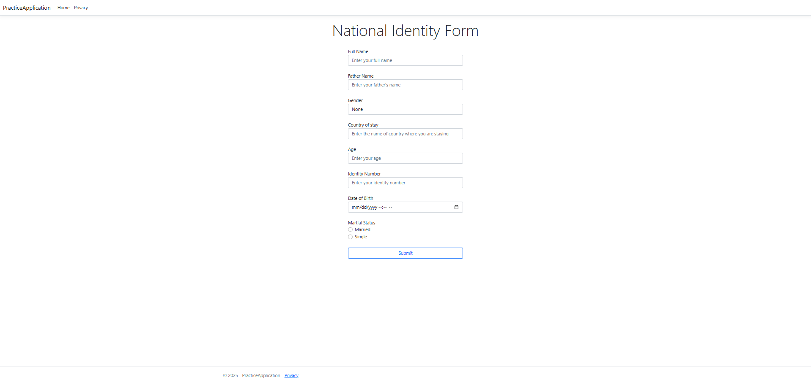

# National Identity Form

A simple .NET Core MVC web application for collecting and displaying personal identity information through a responsive web form.

## Features

- **Responsive Design**: Bootstrap-based layout that works on desktop and mobile devices
- **Comprehensive Form Fields**: Collects essential personal information including:
  - Full Name
  - Father's Name
  - Gender (Dropdown selection)
  - Country of Stay
  - Age (with validation: 0-150)
  - Identity Number (13 characters required)
  - Date of Birth
  - Marital Status (Radio buttons)
- **Server-side Processing**: Form data is processed and displayed upon submission
- **Input Validation**: Built-in HTML5 and ASP.NET Core validation

## Prerequisites

- .NET Core 3.1 or later
- Visual Studio 2019/2022 or Visual Studio Code
- Basic knowledge of ASP.NET Core MVC

## Project Structure

```
PracticeApplication/
├── Controllers/
│   └── HomeController.cs
├── Models/
│   └── PersonModel.cs
├── Views/
│   └── Home/
│       └── Index.cshtml
└── README.md
```

## Setup Instructions

1. **Clone or Download** the project to your local machine

2. **Open the project** in Visual Studio or Visual Studio Code

3. **Restore NuGet packages** (if needed):
   ```bash
   dotnet restore
   ```

4. **Build the project**:
   ```bash
   dotnet build
   ```

5. **Run the application**:
   ```bash
   dotnet run
   ```

6. **Navigate** to `https://localhost:5001` or `http://localhost:5000` in your browser

## Model Structure

The `PersonModel` class should include the following properties:

```csharp
public class PersonModel
{
    public string Name { get; set; }
    public string FatherName { get; set; }
    public Gender Gender { get; set; }
    public string CountryOfStay { get; set; }
    public int Age { get; set; }
    public string IdentityNumber { get; set; }
    public DateTime Dob { get; set; }
    public bool IsMarried { get; set; }
}

public enum Gender
{
    Male,
    Female,
    Other
}
```

## Controller Actions

### GET Index
- Displays the identity form
- Returns the main view with an empty model

### POST Index
- Processes the submitted form data
- Returns a formatted string containing all submitted information
- Input parameter: `PersonModel` object with form data

## Form Validation

The form includes several validation features:

- **Age**: Minimum 0, Maximum 150
- **Identity Number**: Exactly 13 characters required
- **Required Fields**: All fields are expected to be filled
- **Date Format**: Standard date picker for Date of Birth
- **Radio Buttons**: Ensures single selection for marital status

## Usage

1. Fill out all the form fields with your personal information
2. Select your gender from the dropdown menu
3. Choose your marital status using the radio buttons
4. Click the "Submit" button
5. View your submitted information displayed on the result page

## Customization

### Styling
- The form uses Bootstrap classes for responsive design
- Modify the CSS classes in the view to change the appearance
- The form is centered using Bootstrap's grid system (`col-sm-4` offset)

### Validation
- Add data annotations to the `PersonModel` properties for server-side validation
- Implement client-side validation using jQuery Validation
- Customize error messages and validation rules as needed

### Output Format
- Currently returns a simple string format
- Can be modified to return JSON, redirect to a success page, or save to database

## Technologies Used

- **.NET Core MVC**: Web framework
- **Bootstrap**: CSS framework for responsive design
- **HTML5**: Form structure and basic validation
- **Razor Pages**: Server-side rendering

# Demonstration


